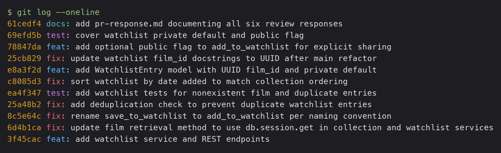

# PR Response Doc — CineLog Watchlist Feature

## Commit history (after interactive rebase)
The branch was rewritten into clean, conventional commits — one logical change each, no merge commits — rebased on the UUID `main`.



```
docs: add pr-response.md documenting all six review responses
test: cover watchlist private default and public flag
feat: add optional public flag to add_to_watchlist for explicit sharing
fix:  update watchlist film_id docstrings to UUID after main refactor
feat: add WatchlistEntry model with UUID film_id and private default
fix:  sort watchlist by date added to match collection ordering
test: add watchlist tests for nonexistent film and duplicate entries
fix:  add deduplication check to prevent duplicate watchlist entries
fix:  rename save_to_watchlist to add_to_watchlist per naming convention
fix:  update film retrieval method to use db.session.get in collection and watchlist services
feat: add watchlist service and REST endpoints
```

## AI Usage
I used Claude Code (Anthropic's AI CLI) throughout this project. Specifically:

- **Orientation:** had it summarize `models.py`, `services/collection_service.py`, and `tests/test_collection.py`, and explain the `add_to_collection()` deduplication pattern, before I made changes.
- **Review comments:** used it to pull the six review comments from the PR and map each to the code it touched.
- **Code changes:** it implemented the mechanical changes — the rename + call sites (Comment 1), the deduplication check and route error handling (Comment 2), the `tests/test_watchlist.py` file (Comment 3), the date-added sort (Comment 5), the private-visibility default (Comment 4), and the optional `public` toggle (stretch). It also resolved the `Integer`→`String(36)` UUID conflict in `models.py` during the rebase (Comment 6).
- **Commit hygiene:** used it to check the commit messages against the conventional-commit format and to reshape the history with an interactive rebase.
- **Design responses (Comments 4 & 5):** I made the two design *decisions* myself — private-by-default visibility, and date-added sort order — and selected them before any argument was written. I then used AI to help draft the written reasoning for each. 

> ⚠️ **Before submitting:** re-read the Comment 4 and Comment 5 write-ups and put anything you'd phrase differently into your own words — the rubric specifically rewards your own CineLog-grounded reasoning there. If your final wording diverges from the AI-assisted draft, update this section to say so.

## Comment 1 — Rename
> Reviewer (`@dev-lead`, inline `services/watchlist_service.py:12`): "`save_to_watchlist()` should follow the project's naming convention. Compare with `add_to_collection()` — the pattern here is `verb_to_noun`. Please rename to `add_to_watchlist()` and update all call sites."

**What I did:**
Renamed `save_to_watchlist()` → `add_to_watchlist()` in `services/watchlist_service.py`, matching the `verb_to_noun` convention already used by `add_to_collection()` / `remove_from_collection()` in the collection service. Updated the one call site in `routes/watchlist/watchlist.py` (both the `import` on line 8 and the call on line 32).

**How I verified:**
Ran a project-wide search — `grep -rn "save_to_watchlist" . --include='*.py'` — before and after the change to locate every reference and confirm none remained. Two references existed (the import and the call), both in the route file; the service definition was the third. After renaming all three, the grep returned no matches. Then ran the full suite (`pytest tests/ -q`) — 4 passed, confirming nothing else referenced the old name.

## Comment 2 — Deduplication
> Reviewer (`@dev-lead`, inline `services/watchlist_service.py:30`): "What happens if a user calls this with a film that's already on their watchlist? The current implementation would add a duplicate entry. Please handle this case."

**What I did:**
Followed the `add_to_collection()` pattern. Added an `AlreadyInWatchlistError` exception (defined in `watchlist_service.py`, mirroring how `collection_service.py` defines its own `AlreadyInCollectionError` rather than sharing one). Inside `add_to_watchlist()` I query `WatchlistEntry.query.filter_by(user_id=..., film_id=...).first()` — which returns the existing row or `None` — and raise `AlreadyInWatchlistError` if a match exists, *before* inserting. The check sits after the `FilmNotFoundError` check so a nonexistent film reports "not found," not "already on watchlist."

I also wrapped the call in `routes/watchlist/watchlist.py` in `try/except` so `FilmNotFoundError`→404 and `AlreadyInWatchlistError`→409, matching `routes/collection.py`. The watchlist route previously caught no exceptions, so a duplicate or missing film would have surfaced as an unhandled 500.

**Design note (DB constraint vs. service check):** `CollectionEntry` has *both* a service-level check and a `UniqueConstraint("user_id", "film_id")` at the model level; `WatchlistEntry` has neither. I added the service-level check only. It directly satisfies the review comment and keeps the change out of `models.py`, which avoids tangling with the Integer→UUID model migration handled in Comment 6. A matching `UniqueConstraint` on `WatchlistEntry` would be a sensible defense-in-depth follow-up (it guards against races/direct inserts the service check can't), but it's a separate model change and I scoped it out of this comment.

**How I verified:**
Confirmed the module imports cleanly and ran the full suite (4 passed). The dedup path itself is covered by a dedicated test added under Comment 3 (`test_add_to_watchlist_duplicate_raises`), which asserts the second add raises and that only one row persists.

## Comment 3 — Missing test
> Reviewer (`@dev-lead`, conversation): "Please add a test for the case where `film_id` doesn't exist in the database. Look at the existing tests in `test_collection.py` — the pattern is there."

**What I did:**
Created `tests/test_watchlist.py`, modeled on `tests/test_collection.py`. I copied the three fixtures verbatim (`app` with an in-memory SQLite DB, `sample_user`, `sample_film`) so the suites stay consistent. The requested test, `test_add_to_watchlist_nonexistent_film_raises`, is the direct equivalent of `test_add_to_collection_nonexistent_film_raises`: it passes a `film_id` that isn't in the DB and asserts `add_to_watchlist` raises `FilmNotFoundError` (via `pytest.raises`) rather than a DB integrity error. I also added `test_add_to_watchlist_creates_entry` as the baseline happy-path check.

**Stretch — second (unrequested) test:** I added `test_add_to_watchlist_duplicate_raises`. I chose the duplicate case because it's the highest-risk edge case the review surfaced: the whole point of Comment 2 is that a silent duplicate corrupts a user's watchlist, and a dedup check with no test can regress unnoticed. It asserts both that the second add raises `AlreadyInWatchlistError` *and* that exactly one row persists (`.count() == 1`) — proving the guard prevents the write, not just that it raises.

**How I verified:**
`pytest tests/test_watchlist.py -v` → 3 passed. `pytest tests/ -q` → 7 passed (4 collection + 3 watchlist), confirming the new file doesn't interfere with the existing suite.

## Comment 4 — Default visibility
> Reviewer (`@dev-lead`, conversation): "watchlists default to `public=True`. We don't have a documented decision on default visibility for user lists… add a note to your PR description explaining your reasoning. I want to make sure we're being intentional here, not just inheriting a default."

**My position:** Default watchlists to **private** (`public=False`). I changed the model default in `models.py` and documented it here.

**Reasoning:** A watchlist and a collection hold fundamentally different kinds of data in CineLog. A `CollectionEntry` is a record of a film the user *has already watched* — a statement about the past, often something they're happy to share along with a rating. A `WatchlistEntry` is a film the user *intends* to watch — a signal about future behavior and current interest they haven't acted on. Future intent is both more revealing and more provisional than viewing history: what someone plans to watch can hint at their mood or personal situation (e.g. adding several films tied to a life event, a health topic, or a curiosity they're not ready to broadcast). Because the user hasn't *done* anything yet, defaulting that list to public exposes private intent without the user ever making a choice.

That's exactly the reviewer's "intentional, not inherited" concern. `public=True` reads like a value inherited from the assumption that everything on a social app should be shareable. The more defensible default is the one whose failure mode is recoverable: a user can always flip a private list to public later, but you can't retroactively un-expose a list that was already visible. Defaulting to private follows the principle of least astonishment — a new user adding films shouldn't discover *after the fact* that their plans were public.

**Tradeoff acknowledged:** CineLog is a **community** film app, and public-by-default is the choice that maximizes the social value — friends discovering what each other plan to watch, recommendations, and the network effects that make a shared film tracker worth using. Private-by-default means most watchlists stay hidden unless users take an explicit action, which genuinely weakens discovery and the social graph, especially early on when there's little public content to draw people in. I'm accepting that reduced default discoverability in exchange for not exposing users' intentions without consent. Crucially, the social value isn't *lost* — it's gated behind an opt-in: the `public` flag still exists per entry, so sharing can be made a one-tap choice (see the visibility-toggle stretch note below). We trade a weaker default for a safer one, and recover discovery through explicit sharing rather than surprise exposure.

## Comment 5 — Sort order
> Reviewer (`@dev-lead`, inline `services/watchlist_service.py:50`): "I'd prefer watchlists to default to 'date added' order rather than alphabetical. Most users want to see what they added recently. I'm open to discussion if you see it differently — but let's make a decision and document it."

**My position:** I **agree** with the reviewer — sort by `date_added` descending (newest first). I changed `get_watchlist()` from `Film.title.asc()` to `WatchlistEntry.date_added.desc()`.

**Reasoning:** Beyond agreeing, there's a CineLog-specific consistency argument that makes this stronger than a preference. `get_collection()` **already** sorts `date_added.desc()`. As shipped, the watchlist sorted alphabetically while its sibling feature sorted by recency — an inconsistency with no stated rationale, so a user moving between "my collection" and "my watchlist" got two different mental models for no reason. Matching the collection's ordering removes that friction. On the merits: a watchlist is functionally a *queue* of things you've been meaning to watch, so the meaningful axis is *when* you added something. Alphabetical order is arbitrary relative to how anyone actually uses the list — a title starting with "A" has no relationship to what the user cares about right now.

**Engagement with reviewer's point:** The reviewer's claim is "most users want to see what they added recently," and I largely buy it — but I did weigh the alternative the claim glosses over: **newest-first vs. oldest-first**. There's a real user story for oldest-first — someone who wants to finally watch the film they saved months ago and clear their backlog (the "I've been meaning to get to this" case). I chose newest-first anyway, for two reasons: it keeps parity with the collection's newest-first ordering, and the more common interaction is "what did I just add / what's fresh on my mind" rather than backlog-clearing. Oldest-first is a legitimate but narrower use case that's better served later as an optional sort parameter than baked in as the default.

**Weakness of my choice:** In a long watchlist, a *specific* film a user is hunting for gets buried by recency — though alphabetical wouldn't reliably surface it either. Neither ordering is the right tool for targeted lookup; that's a job for search/filter, which is a separate concern and out of scope for this PR. Default sort should optimize the common case (browsing what's recent), not the lookup case, so I don't think "hard to find one film" should drive the default.

## Comment 6 — Rebase
> Reviewer (`@dev-lead`, conversation): "A refactor merged to `main` that changed film IDs from integers to UUIDs. Your watchlist code still references integer IDs. Please rebase on `main` and update accordingly."

**What conflicted:**
My `feature/watchlist` branch was based on the *pre-refactor* `main`, so `git rebase origin/main` replayed all my commits onto the UUID `main` and surfaced two conflicts:
1. **`.gitignore` (add/add):** `main` had gained its own `.gitignore` (including `.pytest_cache/`) in the refactor merge, and my `chore` commit added one too.
2. **`models.py` (content):** `main` migrated `Film.id` and `CollectionEntry.film_id` to `db.String(36)` UUIDs, but my `WatchlistEntry` still declared `film_id = db.Column(db.Integer, ...)` — an integer foreign key pointing at a now-UUID primary key.

**How I resolved it:**
- `.gitignore`: took the **union** of both versions (kept `main`'s `.pytest_cache/` line plus my `.venv/`, `*.db`, etc.) so nothing was lost.
- `models.py`: changed `WatchlistEntry.film_id` from `db.Integer` to `db.String(36)` so the watchlist FK matches the migrated `Film.id`, consistent with how `CollectionEntry.film_id` was migrated. After the rebase completed I also updated the two remaining integer references the reviewer flagged: the `film_id (int)` docstring in `add_to_watchlist()` (→ `film_id (str): UUID of the film.`) and the `Body: { "film_id": <int> }` comment in the route (→ `"<uuid>"`), matching the collection service/route wording.

**How I verified no conflict remains:**
- `grep -rniE '\bint\b|pre-refactor' services/watchlist_service.py routes/watchlist/watchlist.py` → no matches.
- `git log --merges origin/main..HEAD` → empty (no merge commits — it's a true rebase, not a merge).
- `pytest tests/ -q` → 7 passed. The nonexistent-film test uses a UUID string id, and `sample_film` now gets a UUID via the model default, so the suite exercises the UUID path end-to-end.

## Stretch features implemented
- **Second (unrequested) test** — `test_add_to_watchlist_duplicate_raises` (see Comment 3 for why I picked the duplicate case).
- **Visibility toggle** — added an optional `public` parameter to `add_to_watchlist()` (defaults to `False`) and threaded it through the `POST /watchlist/<user_id>/add` endpoint via `data.get("public", False)`. This makes the Comment 4 decision concrete: entries are private by default, and callers opt in to sharing explicitly. Covered by `test_add_to_watchlist_defaults_to_private` and `test_add_to_watchlist_respects_public_flag`.
- *Not implemented:* `remove_from_watchlist()` — noted as a natural follow-up but out of scope for this review cycle.

---

## PR Description

### What this feature does
Adds a **watchlist** to CineLog — a per-user list of films a user intends to watch, distinct from the existing collection (films already watched). It introduces:
- **Model:** `WatchlistEntry` (`models.py`) — `user_id`/`film_id` (both UUID), `date_added`, and a `public` flag defaulting to `False`.
- **Service:** `services/watchlist_service.py` — `add_to_watchlist(user_id, film_id, public=False)` (validates the film exists, rejects duplicates) and `get_watchlist(user_id)` (returns films sorted newest-first by date added).
- **Endpoints:** `GET /watchlist/<user_id>` (view) and `POST /watchlist/<user_id>/add` (add; body `{"film_id": "<uuid>", "public": false}`), returning `404` for unknown films and `409` for duplicates.

### Design decisions
1. **Default visibility = private (`public=False`).** A watchlist reveals *future intent*, which is more sensitive than viewing history, so sharing is an explicit opt-in rather than an inherited default. Full reasoning and the discovery tradeoff are in **Comment 4** above.
2. **Sort order = date added, newest first.** Matches `get_collection()` for a consistent mental model and reflects how a watchlist is actually browsed. Full reasoning (including newest- vs. oldest-first) is in **Comment 5** above.

### How to manually test
The app has no user/film creation endpoints (films are seeded, and there's no frontend), so seed a user and a film first, then exercise the endpoints.

1. **Start the app:**
   ```bash
   source .venv/bin/activate
   python app.py            # runs at http://127.0.0.1:5000
   ```
2. **In a second terminal, seed a user + film and print their UUIDs:**
   ```bash
   python -c "
   from app import create_app, db
   from models import User, Film
   app = create_app()
   with app.app_context():
       u = User(username='ada', email='ada@example.com')
       f = Film(title='Arrival', year=2016, genre='Sci-Fi')
       db.session.add_all([u, f]); db.session.commit()
       print('USER', u.id); print('FILM', f.id)
   "
   ```
3. **Add the film to the watchlist** (expect `201` + the entry, `public: false`):
   ```bash
   curl -X POST http://127.0.0.1:5000/watchlist/<USER_ID>/add \
     -H "Content-Type: application/json" -d '{"film_id":"<FILM_ID>"}'
   ```
4. **View the watchlist** (expect the film, newest-first):
   ```bash
   curl http://127.0.0.1:5000/watchlist/<USER_ID>
   ```
5. **Add the same film again** (expect `409` — dedup working):
   ```bash
   curl -X POST http://127.0.0.1:5000/watchlist/<USER_ID>/add \
     -H "Content-Type: application/json" -d '{"film_id":"<FILM_ID>"}'
   ```
6. **Add a nonexistent film** (expect `404`):
   ```bash
   curl -X POST http://127.0.0.1:5000/watchlist/<USER_ID>/add \
     -H "Content-Type: application/json" \
     -d '{"film_id":"00000000-0000-0000-0000-000000000000"}'
   ```
7. **Opt in to public sharing** (add a *different* film with `public:true`, expect `public: true` in the response):
   ```bash
   curl -X POST http://127.0.0.1:5000/watchlist/<USER_ID>/add \
     -H "Content-Type: application/json" -d '{"film_id":"<OTHER_FILM_ID>","public":true}'
   ```
8. **Or just run the tests:** `pytest tests/ -v` → 9 passing.

### Notes
- Rebased on the UUID `main` (no merge commits); `WatchlistEntry.film_id` migrated from `Integer` to `String(36)` to match the refactor.
- New watchlist logic mirrors the collection service's patterns (custom exceptions, service-level dedup, route-level `try/except`).
